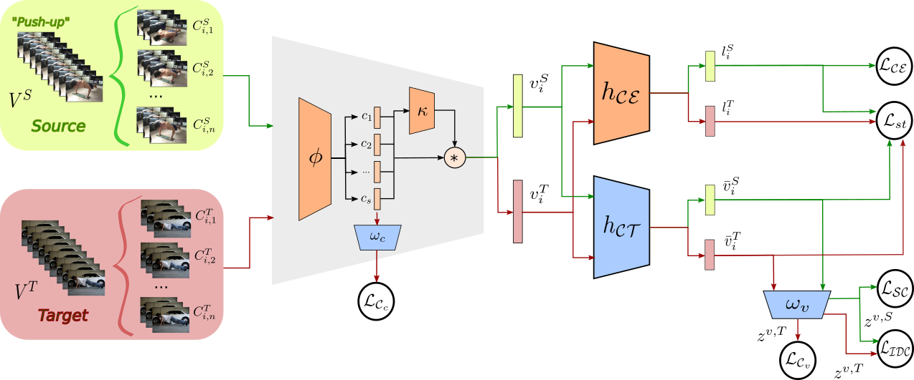

# CO2A



This repository contains the official implementation for CO2A from Turrisi da Costa, V. G.; Zara, G.; Rota, P.; Santos, T. O.; Sebe, N.; Murino, V.; Ricci, E. - "Dual Contrastive Domain Adaptation for Video Action Recognition" in Proc. of the IEEE/CVF Winter Conference on Applications of Computer Vision (WACV), 2022.

## Mixamo dataset

The current version of the Mixamo dataset and the respective Kinetic subset can be downloaded [here](https://drive.google.com/drive/folders/1vGeWBXO5hcFlEll-PLw6zbg-5QSauQGi?usp=sharing).


---

## Repository structure

The repository is structured in the following way:

- :file_folder: `src`: source code
- :large_blue_diamond: `bash_scripts`: scripts to reproduce results in the paper

---

## Requirements

```
numpy
torch
torchvision
pytorch-lightning
pytorch-lightning-bolts
Pillow
tqdm
wandb
```

Required python modules can be installed by running 

```
pip3 install -r requirements.txt
```

## Usage

Experiments can be launched by running the scripts in `bash_scripts`


The framework assumes the required pretrained weights files to be stored in a directory called `pretrained`, in the repository root. 
You can download it with
```
wget --no-check-certificate 'https://docs.google.com/uc?export=download&id=1uPvokqwmWlLf3ihUF4spYNEPecDMFA5A' -O pretrained/rgb_imagenet.pt
```
Or in the the following [link](https://drive.google.com/file/d/1uPvokqwmWlLf3ihUF4spYNEPecDMFA5A/view?usp=sharing).


The script can be run with additional flags; we report here the most important ones:

```
--name                                  ---->     name of wandb run - STRING
--project                               ---->     name of wandb project - STRING
--epochs                                ---->     number of epochs - INT - default: 300
--optimizer                             ---->     optimizer - STRING - choices: ["sgd", "adam"] - default: "adam"
--weight_decay                          ---->     weight decay value - FLOAT - default: 1e-6
--scheduler                             ---->     scheduler type - STRING - choices: ["reduce", "cosine", "step", "exponential", "none"] - default: "reduce"
--n_frames                              ---->     number of frames to use for each clip - INT - default: 16
--n_clips                               ---->     number of clips to use - INT - default: 4
--frame_size                            ---->     size of one frame - INT - default: 64
--batch_size                            ---->     batch size - INT - default: 32
--num_workers                           ---->     number of parallel jobs - INT - default: 4
--video_dropout                         ---->     droupout at video-level layer - FLOAT - default: 0.5
--ce_loss_weight                        ---->     cross-entropy loss weight - FLOAT - default: 1.0
--ce_loss_target_weight                 ---->     cross-entropy loss weight for target - FLOAT - default: 0.0
--nce_loss_target_aug_based_weight      ---->     augmentation based nce weight - FLOAT - default: 0.0
--nce_loss_source_label_based_weight    ---->     source label based nce weight - FLOAT - default: 0.0
--nce_loss_target_label_based_weight    ---->     target label based nce weight - FLOAT - default: 0.0
--nce_loss_inter_domain_weight          ---->     inter domain loss weight -  FLOAT - default: 0.0
--nce_loss_target_clip_aug_based_weight ---->     clip augmentation nce weight - FLOAT - default: 0.0
--consistency_loss_weight               ---->     consistency loss weight - FLOAT - default: 0.0
--consistency_threshold                 ---->     threshold value to use for consistency - FLOAT - default: 0.5
--temperature                           ---->     temperature for the losses - FLOAT - 0.2
--selection_factor                      ---->     factor for selecting instances according to confidence - INT - default: 6
--complete_nce_weight                   ---->     complete nce weight - FLOAT - default: 0.0
--target_2_augs                         ---->     whether to apply the 2 target augmentations
--target_augmentations                  ---->     list of target augmentations - LIST - default: []
--supervised_labels                     ---->     use ground-truth target labels for contrastive loss 
--source_only                           ---->     whether to train on source only (disable DA) 
--pretrained                            ---->     use imagenet+kinetics pre-training 
--imagenet_pretrained                   ---->     use imagenet pretraining 
--mixamo14_pretrained                   ---->     use mixamo pretraining 
--clip_aggregation                      ---->     clip aggregation strategy - STRING - choices: ["avg", "lstm", "lstm_weights", "mlp", "mlp_weights", "multihead_attention", "multihead_attention_att_only"]
--gpus                                  ---->     list of gpus to use - INT
--distributed_backend                   ---->     type of distribute backend - STRING - choices: ["dp", "ddp"] - default: "ddp"
--wandb                                 ---->     whether to log on wandb 
```

